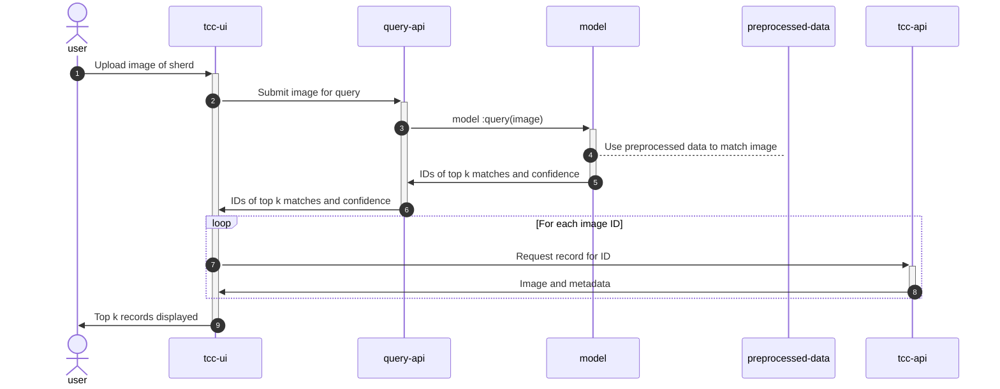
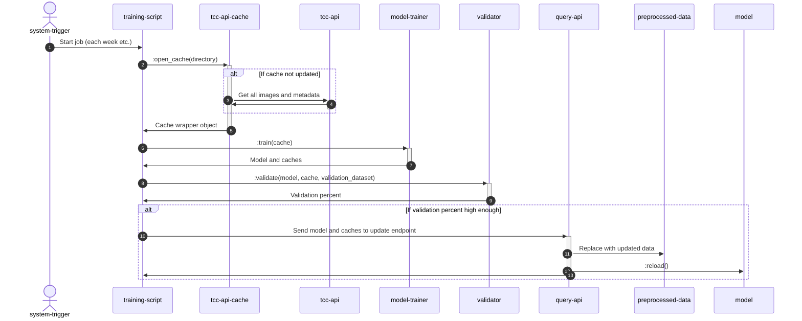

# System UML Diagrams

## Sequence

### Query image

```mermaid
sequenceDiagram
    autonumber
    
    actor user
    
    user->>+tcc-ui: Upload image of sherd
    tcc-ui->>+query-api: Submit image for query
    query-api->>+model: model :query(image)
    model-->+preprocessed-data: Use preprocessed data to match image
    model->>-query-api: IDs of top k matches and confidence
    query-api->>-tcc-ui: IDs of top k matches and confidence
    loop For each image ID 
        tcc-ui->>+tcc-api: Request record for ID
        tcc-api->>-tcc-ui: Image and metadata
    end
    tcc-ui->>-user: Top k records displayed
```

### Update Model

```mermaid
sequenceDiagram
    autonumber
    actor system-trigger
    
    system-trigger->>training-script: Start job (each week etc.)
    training-script->>+tcc-api-cache: :open_cache(directory)
    alt If cache not updated 
        tcc-api-cache->>+tcc-api: Get all images and metadata
        tcc-api->>-tcc-api-cache: 
    end
    tcc-api-cache->>-training-script: Cache wrapper object
    training-script->>+model-trainer: :train(cache)
    model-trainer->>-training-script: Model and caches
    training-script->>+validator: :validate(model, cache, validation_dataset)
    validator->>-training-script: Validation percent
    alt If validation percent high enough 
        training-script->>+query-api: Send model and caches to update endpoint
        query-api->>preprocessed-data: Replace with updated data
        query-api->>model: :reload()
        query-api->>-training-script: 
    end
    
```

## Communication

TODO 