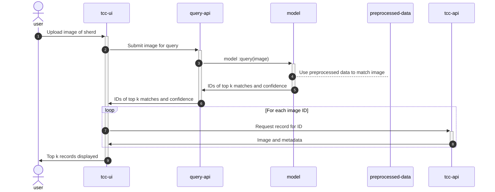
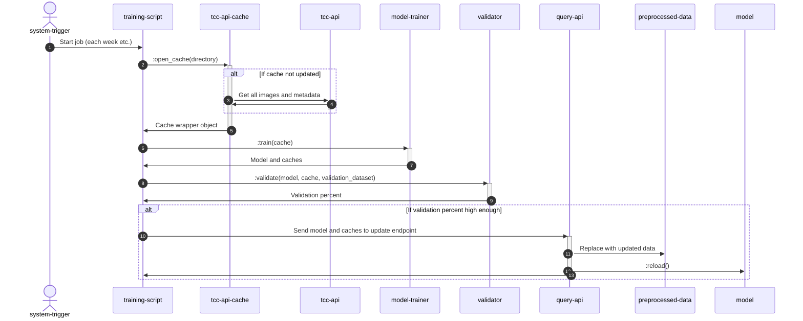

# System UML Diagrams

## Sequence

### Query image


### Update Model


## Communication

### Query image
````mermaid
stateDiagram-v2
    direction LR
    
    state tcc_api
    state query_api
    state model
    state preprocessed-data
    state tcc_ui
    state training_script 
    state tcc_api_cache
    state model-trainer
    state validator
    state user
    
    user-->tcc_ui: 1 Upload image of sherd
    tcc_ui-->query_api: 1.1 Submit image for query
    query_api-->model: 1.1.1 query(image)
    model-->preprocessed_data: 1.1.1.1 retrieve(dir)
    model--> query_api: 1.1.2 IDs of top k matches and confidence
    query_api-->tcc_ui: 1.2 IDs of top k matches and confidence
    
    tcc_ui-->tcc_api: 1.3 Request record for ID
    tcc_api-->tcc_ui: 1.4 Image and metadata
    
    tcc_ui-->user: 1.5 Tok k records displayed
````

### Update model
````mermaid
stateDiagram-v2
    direction LR
    
    state tcc_api
    state query_api
    state model
    state preprocessed_data
    state tcc_ui
    state training_script 
    state tcc_api_cache
    state model_trainer
    state validator
    state system_trigger
    
    system_trigger-->training_script: 1 Start job
    training_script-->tcc_api_cache: 1.1 open_cache(directory)
    tcc_api_cache-->tcc_api: 1.1.1 Get all images and metadata
    tcc_api-->tcc_api_cache: 1.1.2 Images and metadata
    tcc_api_cache-->training_script: 1.2 Cache wrapper object
    training_script-->model_trainer: 1.3 train(cache)
    model_trainer-->training_script: 1.4 Model and caches
    training_script-->validator: 1.5 validator(model, cache, validation_dataset)
    validator-->training_script: 1.6 Validation percent
    training_script-->query_api: 1.7 Send model and caches to update endpoint
    query_api-->preprocessed_data: 1.7.1 Replace with updated data 
    query_api-->model: 1.7.2 reload()
````